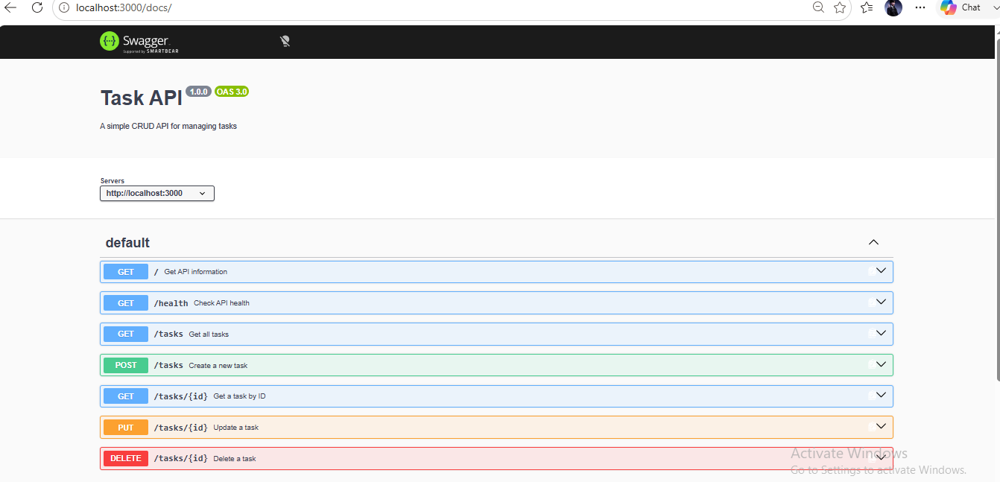

# Task API
A simple REST API for managing tasks, built with Node.js and Express.

## Installation and Running
Install the project dependencies:

```bash
npm install
```

Start the API:

```bash
npm start
```

The API will run at:
`http://localhost:3000`

Swagger API documentation is available at:
`http://localhost:3000/docs`

## API Endpoints

| Method | Endpoint | Description |
|---|---|---|
| GET | `/` | Returns basic API information |
| GET | `/health` | Checks whether the API is running |
| GET | `/tasks` | Returns all tasks |
| GET | `/tasks/:id` | Returns one task by ID |
| POST | `/tasks` | Creates a new task |
| PUT | `/tasks/:id` | Updates an existing task |
| DELETE | `/tasks/:id` | Deletes a task |
| GET | `/docs` | Opens the Swagger UI documentation |

## Example curl -i Output

Command:

```bash
curl -i http://localhost:3000/health
```

Output:

```text
HTTP/1.1 200 OK
Content-Type: application/json; charset=utf-8

{"status":"ok"}
```


## Swagger Documentation
The API includes interactive Swagger documentation.

Open:
`http://localhost:3000/docs`

## Swagger UI Screenshot


## Important Note About Data
This API currently stores tasks in memory rather than in a database. Tasks created while the server is running will be lost when the server is stopped or restarted.

## Project Structure

```text
CRUD-API/
├── server.js
├── openapi.json
├── package.json
├── package-lock.json
├── swagger.png
├── .gitignore
└── README.md

